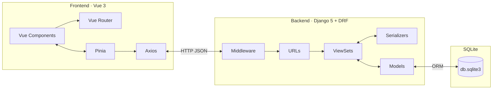
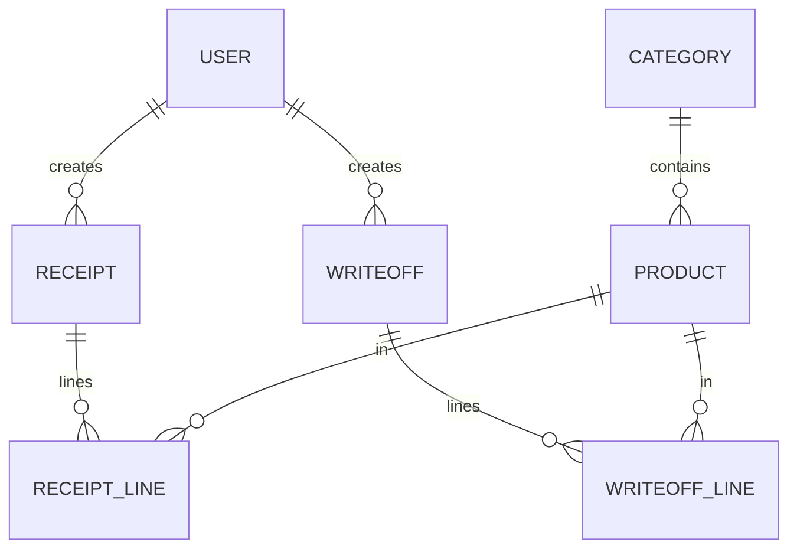

# Техническое задание  
# Система учёта складских запасов

**Версия документа:** 1.0  
**Дата:** 12.04.2026  
**Стек:** Django 5, Django REST Framework (DRF), Vue.js 3, Pinia, Vue Router, Axios, SQLite  

---

## 1. Общие сведения

### 1.1. Наименование и назначение

**Наименование:** «Система учёта складских запасов» (далее — Система).  

**Назначение:** автоматизация складского учёта: ведение справочников товаров и категорий, регистрация поступлений и списаний, контроль текущих остатков и минимального запаса, формирование отчётов по движению товаров за период, разграничение доступа по ролям.

### 1.2. Целевая аудитория

| Роль | Основные задачи в Системе |
|------|---------------------------|
| Кладовщик | Списания, просмотр остатков и документов, отчёты |
| Менеджер по закупкам | Поступления, справочник товаров/категорий, минимальные остатки, отчёты |
| Администратор системы | Управление пользователями и доступом, контроль справочников и документов |

### 1.3. Технические ограничения стека

- **Backend:** Python 3.11+, Django 5.x, DRF; аутентификация — по выбранной на этапе проектирования схеме (сессии или JWT), с обязательной защитой API.
- **Frontend:** Vue.js 3 (Composition API), Pinia, Vue Router, Axios; сборка — Vite.
- **СУБД:** SQLite (файл `db.sqlite3`); допускается последующая миграция на PostgreSQL без изменения внешнего контракта API (не входит в объём текущего ТЗ).

### 1.4. Границы системы

**Входит:** веб-клиент, REST API, хранение данных, базовая административная панель (опционально — Django Admin для служебных операций).  

**Не входит:** бухгалтерский учёт в полном объёме, интеграция с 1С/ERP, штрихкодирование и ТСД (возможны как этапы развития), многопользовательская очередь печати этикеток.

### 1.5. Документы-основания

Предметная область и сущности согласованы с концептуальной моделью: пользователи, категории, товары, документы поступления и списания с позициями строк.

---

## 2. Предметная область

### 2.1. Описание процессов

На склад оформляются **поступления** (приход от поставщика с указанием номера документа, даты, поставщика и строк с товарами, количествами и ценами). Со склада оформляются **списания** (расход с указанием причины и строк). **Текущий остаток** по товару определяется суммой проведённых движений (приход минус расход) либо хранится денормализованно в карточке товара с пересчётом при проведении документов — способ фиксируется в архитектурном решении (см. раздел 5).

Для каждого товара задаётся **минимальный запас**; при остатке ниже минимума Система должна обеспечивать **визуальную индикацию** и возможность отбора в отчётах/остатках.

### 2.2. Основные сущности (логический уровень)

| Сущность | Краткое описание |
|----------|------------------|
| Пользователь | Учётная запись, роль, ФИО, признак активности |
| Категория | Группировка товаров |
| Товар | Складская позиция: SKU, единица измерения, цена закупки, остаток, минимум, связь с категорией |
| Поступление | Шапка документа прихода |
| Позиция поступления | Строка документа: товар, количество, цена, сумма |
| Списание | Шапка документа расхода |
| Позиция списания | Строка документа: товар, количество, цена, сумма |

Связи: категория 1:N товар; пользователь 1:N поступления и списания (автор); документ 1:N строк; товар 1:N строк в разных документах.

### 2.3. Статусы документов (рекомендуемые)

- **Черновик** — редактирование разрешено, на остатки не влияет.  
- **Проведён** — документ неизменяем в части влияющих на склад полей; движения учтены.  
- **Отменён** (опционально) — не влияет на остатки; фиксируется в журнале.

---

## 3. Функциональные требования

Нумерация **FR-xxx**; требований не менее 15.

| ID | Требование | Приоритет |
|----|------------|-----------|
| FR-01 | Система SHALL предоставлять **вход в систему** по логину и паролю с проверкой учётной записи и признака активности. | Высокий |
| FR-02 | Система SHALL поддерживать **не менее трёх ролей**: кладовщик, менеджер по закупкам, администратор, с разным набором разрешённых операций. | Высокий |
| FR-03 | Администратор SHALL иметь возможность **создавать, редактировать и деактивировать** учётные записи пользователей, назначать роль. | Высокий |
| FR-04 | Система SHALL обеспечивать **CRUD категорий** товаров (название, описание). | Высокий |
| FR-05 | Система SHALL обеспечивать **CRUD товаров** с полями: наименование, SKU (уникальный), категория, единица измерения, описание, закупочная цена, минимальный остаток, признак активности. | Высокий |
| FR-06 | Система SHALL хранить **текущий остаток** по товару и обновлять его при **проведении** поступления или списания согласованным алгоритмом (транзакция БД). | Высокий |
| FR-07 | Пользователь с правами SHALL создавать **документ поступления**: шапка (номер, дата, поставщик, комментарий, статус) и **не менее одной** позиции (товар, количество > 0, цена, сумма строки). | Высокий |
| FR-08 | Пользователь с правами SHALL создавать **документ списания**: шапка (номер, дата, причина, комментарий, статус) и **не менее одной** позиции. | Высокий |
| FR-09 | Система SHALL **запрещать проведение** списания, если суммарное списание по строке превышает доступный остаток (с понятным сообщением об ошибке). | Высокий |
| FR-10 | Система SHALL позволять **просматривать реестры** поступлений и списаний с **фильтрами** по дате, статусу, поставщику (для поступлений), автору — в пределах прав. | Средний |
| FR-11 | Система SHALL предоставлять экран **остатков на складе** с табличным представлением, поиском по названию/SKU, фильтром по категории и признаку «ниже минимума». | Высокий |
| FR-12 | Система SHALL формировать **отчёт по движению товаров** за выбранный период с фильтрами по товару и типу движения (поступление/списание). | Средний |
| FR-13 | Система SHALL поддерживать **экспорт** отчёта по движению в CSV (минимум) из веб-интерфейса. | Низкий |
| FR-14 | Система SHALL **журналировать** ключевые действия (создание/проведение документов, изменение пользователей) — уровень детализации согласуется с NFR по логированию. | Средний |
| FR-15 | Система SHALL обеспечивать **валидацию** данных на API: обязательные поля, уникальность SKU, неотрицательные цены, корректные внешние ключи. | Высокий |
| FR-16 | Неактивный товар SHALL **не отображаться** в подборе для новых строк документов по умолчанию (с опцией «показать неактивные» для администратора). | Средний |
| FR-17 | Система SHALL предоставлять **главный экран (дашборд)** с краткой сводкой: число позиций ниже минимума, последние документы — в пределах прав пользователя. | Низкий |

---

## 4. Нефункциональные требования

| ID | Категория | Требование |
|----|-----------|------------|
| NFR-01 | Безопасность | Пароли SHALL храниться только в виде **хэша** (например, PBKDF2 через Django). API SHALL быть доступен только **аутентифицированным** клиентам для защищённых ресурсов; настройка CORS — по окружениям. |
| NFR-02 | Безопасность | SHALL использоваться **HTTPS** в эксплуатации; секреты и `SECRET_KEY` не попадают в репозиторий. |
| NFR-03 | Производительность | Типовые списки (товары, документы) SHALL поддерживать **пагинацию**; время ответа API для пагинированного списка до 100 записей — ориентир **≤ 500 мс** при локальной сети и штатной нагрузке. |
| NFR-04 | Надёжность | Операции проведения документов и обновления остатков SHALL выполняться в **транзакции** БД с откатом при ошибке. |
| NFR-05 | Совместимость | Веб-клиент SHALL поддерживать **последние две мажорные версии** Chrome, Firefox, Edge. |
| NFR-06 | Сопровождаемость | Код SHALL сопровождаться **README**: запуск backend/frontend, переменные окружения, миграции, создание суперпользователя. |
| NFR-07 | Наблюдаемость | Backend SHALL писать **структурированные логи** ошибок уровня приложения (5xx, необработанные исключения API). |
| NFR-08 | Доступность интерфейса | Формы SHALL содержать **понятные сообщения об ошибках** валидации (поле + причина); таблицы — заголовки колонок. |
| NFR-09 | Ограничения SQLite | Одновременная запись с множества процессов ограничена; Система SHALL проектироваться для **умеренной конкуренции** (один сервер приложений); при росте нагрузки планируется миграция СУБД. |

---

## 5. Архитектура

### 5.1. Общая схема

Клиент **Vue 3** через **Axios** обменивается с **DRF** по **HTTP/JSON**. Django обрабатывает запрос через **Middleware**, **URLConf**, **ViewSet/Views**, **Serializers**, **Models**; доступ к данным — **ORM** к файлу **SQLite**.

### 5.2. Модули backend (рекомендуемое разбиение приложений)

| Приложение Django | Ответственность |
|-------------------|-----------------|
| `accounts` | Пользователь, аутентификация, роли/права |
| `catalog` | Категории и товары |
| `inventory` | Поступления, списания, остатки, отчёты |

### 5.3. Модули frontend (рекомендуемое разбиение)

| Область | Содержимое |
|---------|------------|
| `views/` | Экраны: логин, дашборд, справочники, документы, остатки, отчёт, админ |
| `router/` | Маршруты и guards по ролям |
| `stores/` | Pinia: сессия, справочники, документы, отчёты |
| `api/` | Обертки Axios, перехватчики токена/ошибок |

### 5.4. Алгоритм остатков (архитектурное решение)

Рекомендуется **денормализованное поле** `current_stock` в модели товара с атомарным обновлением (`F()`-выражения / `select_for_update` при проведении) в одной транзакции с созданием движений или с пересчётом из агрегатов — выбор фиксируется в проектной записке; в ТЗ зафиксировано требование согласованности FR-06 и NFR-04.

---

## 6. Модель данных

### 6.1. Логическая ER-модель (сжатая)

### 6.2. Таблицы (логические имена)

| Таблица | Ключевые поля | Примечание |
|---------|---------------|------------|
| `users` / `auth_user` + профиль | `id`, `username`, `password_hash`, `full_name`, `role`, `is_active`, `created_at` | Реализация может опираться на `django.contrib.auth` + расширение |
| `categories` | `id`, `name`, `description`, `created_at` | |
| `products` | `id`, `name`, `sku` UK, `category_id` FK, `unit`, `description`, `purchase_price`, `current_stock`, `min_stock`, `is_active`, `created_at` | |
| `receipts` | `id`, `document_number`, `receipt_date`, `supplier_name`, `created_by` FK, `comment`, `status`, `created_at` | |
| `receipt_lines` | `id`, `receipt_id` FK, `product_id` FK, `quantity`, `unit_price`, `line_total` | |
| `writeoffs` | `id`, `document_number`, `writeoff_date`, `reason`, `created_by` FK, `comment`, `status`, `created_at` | |
| `writeoff_lines` | `id`, `writeoff_id` FK, `product_id` FK, `quantity`, `unit_price`, `line_total` | |

Типы: целочисленные идентификаторы, `DECIMAL` для количеств/денег, `TEXT` для длинных комментариев, `DATE`/`DATETIME` для дат.

---

## 7. API endpoints

Базовый префикс: `/api/v1/`. Аутентификация: сессия или `Authorization: Bearer` — выбирается при реализации; в таблице указаны **логические** ресурсы.

| Метод | Endpoint | Назначение |
|-------|----------|------------|
| POST | `/api/v1/auth/login/` | Вход, выдача сессии/токена |
| POST | `/api/v1/auth/logout/` | Выход |
| GET | `/api/v1/auth/me/` | Текущий пользователь и роль |
| GET, POST | `/api/v1/users/` | Список / создание (админ) |
| GET, PATCH, DELETE | `/api/v1/users/{id}/` | Просмотр / изменение / деактивация (админ) |
| GET, POST | `/api/v1/categories/` | Список / создание категории |
| GET, PUT, PATCH, DELETE | `/api/v1/categories/{id}/` | Чтение / обновление / удаление |
| GET, POST | `/api/v1/products/` | Список (фильтры: category, below_min, search) / создание |
| GET, PUT, PATCH, DELETE | `/api/v1/products/{id}/` | Карточка товара |
| GET, POST | `/api/v1/receipts/` | Реестр / создание шапки |
| GET, PATCH | `/api/v1/receipts/{id}/` | Детали / обновление черновика |
| POST | `/api/v1/receipts/{id}/post/` | Проведение поступления |
| GET, POST | `/api/v1/receipts/{id}/lines/` | Список / добавление строк |
| GET, PUT, PATCH, DELETE | `/api/v1/receipt-lines/{id}/` | Строка поступления |
| GET, POST | `/api/v1/writeoffs/` | Реестр / создание |
| GET, PATCH | `/api/v1/writeoffs/{id}/` | Детали / обновление |
| POST | `/api/v1/writeoffs/{id}/post/` | Проведение списания |
| GET, POST | `/api/v1/writeoffs/{id}/lines/` | Строки |
| GET, PUT, PATCH, DELETE | `/api/v1/writeoff-lines/{id}/` | Строка списания |
| GET | `/api/v1/stock/` | Свод остатков (read-only; может совпадать с list products) |
| GET | `/api/v1/reports/movement/` | Отчёт: query `date_from`, `date_to`, `product`, `type` |

*Примечание:* точные имена действий (`post`, `submit`) и вложенность строк могут быть реализованы как отдельные ViewSet actions в DRF; контракт сохраняется по смыслу.

---

## 8. Интерфейс

### 8.1. Общие требования к UI

- Единая **шапка** с навигацией и меню пользователя; **боковое меню** или вкладки по разделам.  
- **Адаптивная вёрстка** для ширины от 1280 px (десктоп — основной сценарий).  
- Обратная связь: **спиннеры** при запросах, **toast** или inline-сообщения при успехе/ошибке.

### 8.2. Перечень экранов

| Экран | Назначение | Основные элементы | Связи |
|-------|------------|-------------------|--------|
| Логин | Вход | Форма логин/пароль, кнопка «Войти» | → Дашборд |
| Дашборд | Сводка | Карточки KPI, последние документы | → Остатки, документы, отчёт |
| Товары (список) | Справочник | Таблица, фильтры, поиск, «Добавить» | → Форма товара |
| Товар (форма) | Создание/редактирование | Форма полей, «Сохранить» | ← Товары |
| Категории | Справочник | Таблица, CRUD | ↔ Товар (выбор категории) |
| Поступления (список) | Реестр | Таблица, фильтры, «Создать» | → Карточка поступления |
| Поступление (карточка) | Документ | Шапка, таблица строк, «Провести» | ← Список |
| Списания (список) | Реестр | Таблица, фильтры | → Карточка списания |
| Списание (карточка) | Документ | Шапка, строки, «Провести» | ← Список |
| Остатки | Контроль запасов | Таблица, фильтр «ниже минимума» | → Товар, отчёт |
| Отчёт по движению | Аналитика | Фильтры периода, таблица, «Экспорт CSV» | → Документы по ссылке |
| Пользователи | Админ | Таблица, форма пользователя | Из меню админа |
| Профиль / смена пароля | Самообслуживание | Форма смены пароля | Меню пользователя |
| Ошибка 403/404 | Навигация | Сообщение, «На главную» | → Дашборд |

### 8.3. Матрица доступа (кратко)

| Экран / действие | Кладовщик | Менеджер | Админ |
|-------------------|-----------|----------|-------|
| Списание, просмотр остатков | Да | Просмотр | Да |
| Поступление, товары, категории, мин. остаток | Ограниченно* | Да | Да |
| Пользователи | Нет | Нет | Да |

\*Уточняется заказчиком; по умолчанию кладовщик не редактирует закупочные цены и справочник.

---

## 9. Глоссарий

| Термин | Определение |
|--------|-------------|
| SKU | Stock Keeping Unit — уникальный артикул/код товара в Системе. |
| Поступление | Документ прихода товара на склад от поставщика. |
| Списание | Документ расхода со склада с указанием причины. |
| Проведение | Перевод документа в состояние, при котором движения учитываются в остатках. |
| Черновик | Документ до проведения; может редактироваться без влияния на остатки. |
| Остаток | Доступное количество товара на складе на текущий момент. |
| Минимальный запас | Пороговое значение для контроля дефицита. |
| DRF | Django REST Framework — библиотека для построения REST API. |
| Pinia | Официальный стор состояния для Vue 3. |
| ORM | Object-Relational Mapping — слой Django для доступа к БД. |

---

## 10. Приложение: критерии приёмки (рекомендуемые)

- Реализованы все разделы API из таблицы раздела 7 в объёме, достаточном для работы экранов из раздела 8.  
- Выполнены FR-01–FR-17 с приоритетом «Высокий» без дефектов блокирующего уровня.  
- Проведение списания при недостаточном остатке возвращает ошибку и не меняет остаток (FR-09, NFR-04).  
- Документация по развёртыванию (NFR-06) проверена на «чистой» машине разработчика.

---

*Конец документа.*
